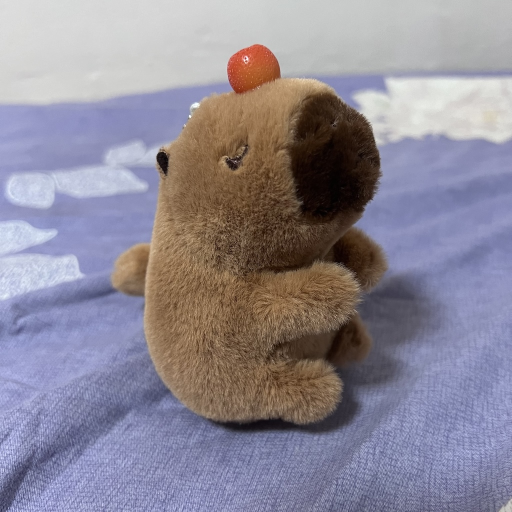
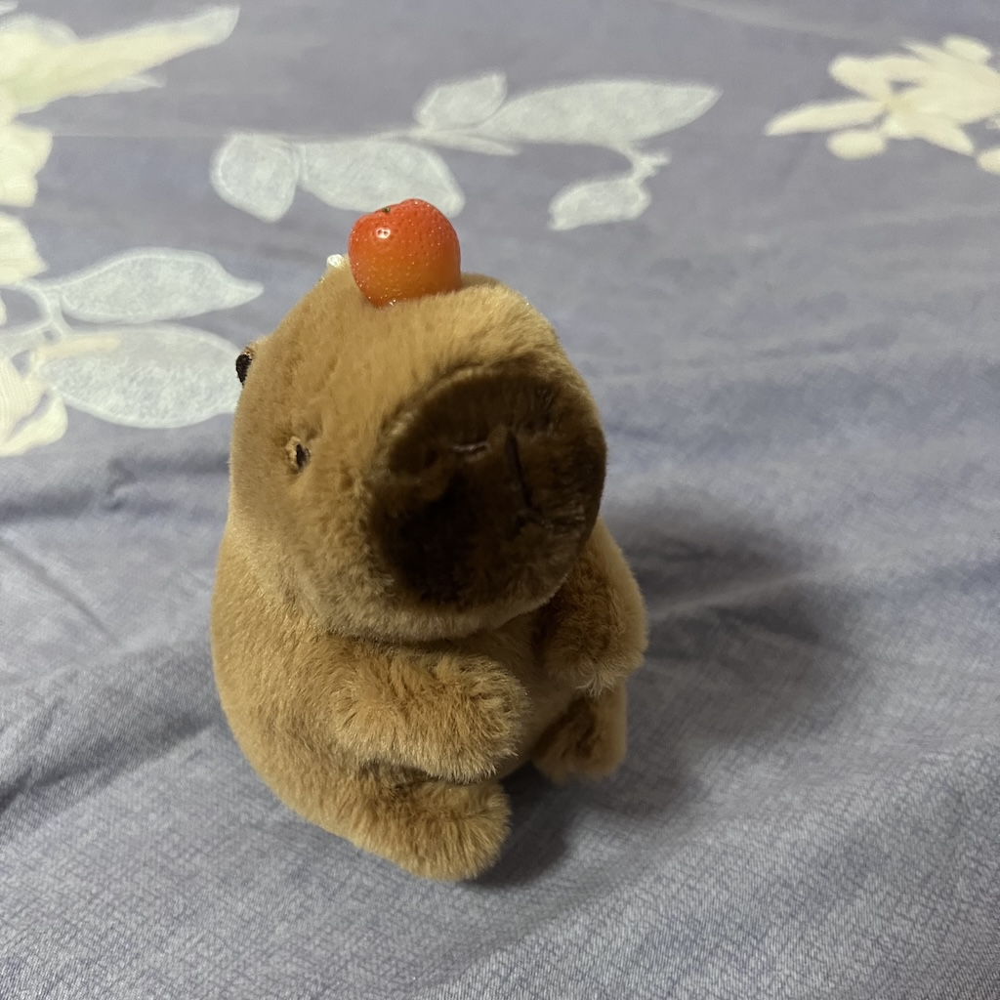
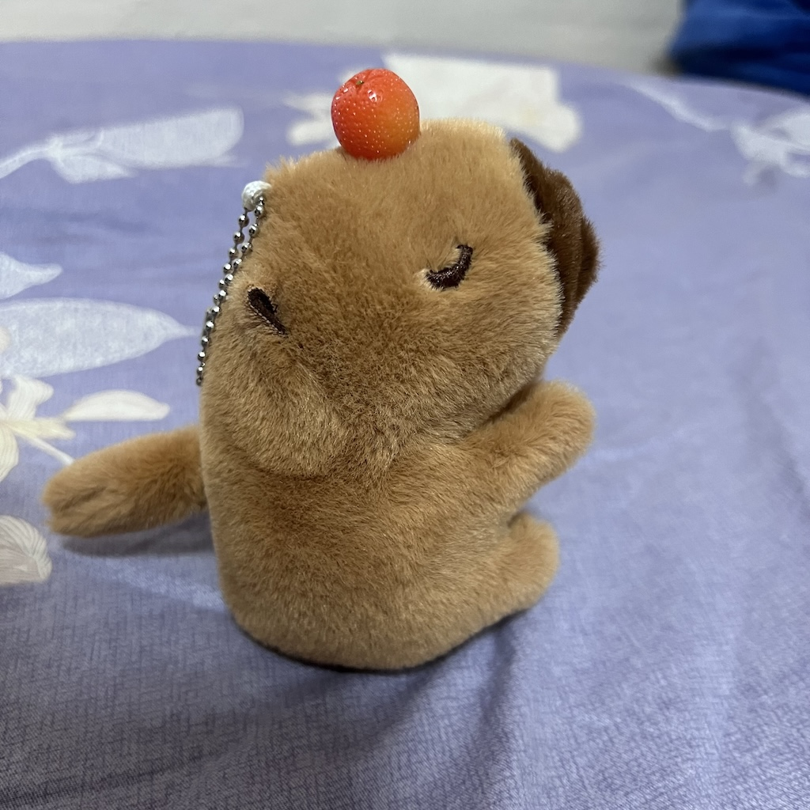
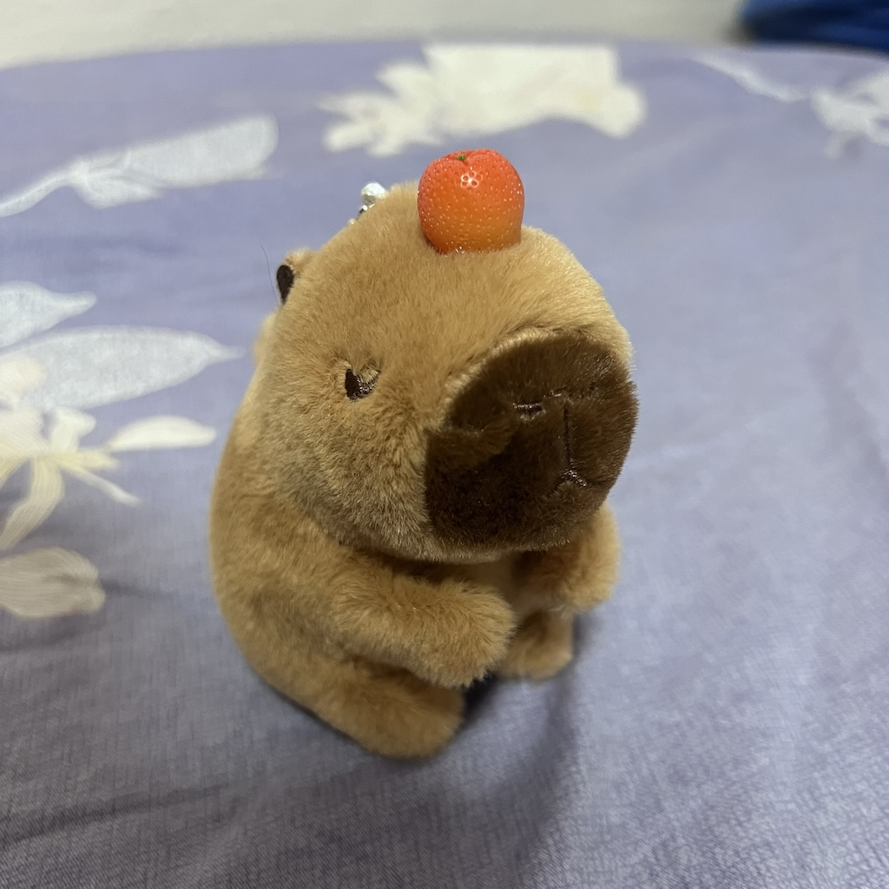
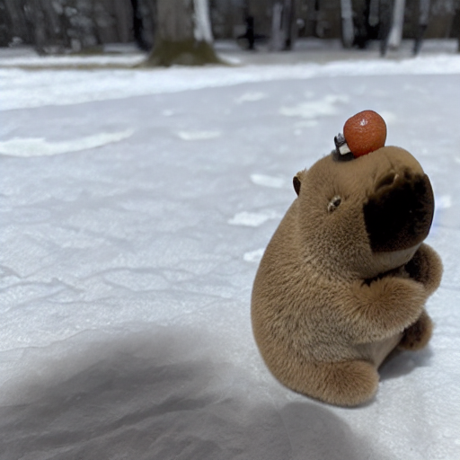
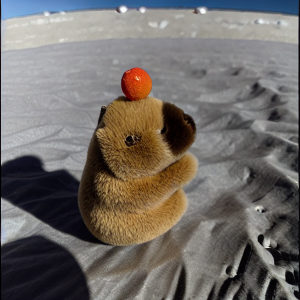
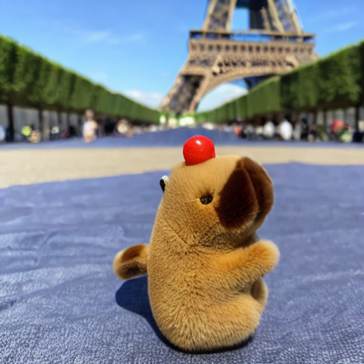

# dreambooth-colossal-ai

# This repository aims to train a [DreamBooth](https://arxiv.org/abs/2208.12242) model using techniques from [Colossal AI](https://github.com/hpcaitech/ColossalAI/tree/main)

Most of the code has been copied and adapted from [https://github.com/hpcaitech/ColossalAI/tree/main/examples/images/dreambooth](https://github.com/hpcaitech/ColossalAI/tree/main/examples/images/dreambooth)


## Instructions for installation 

On a device with cuda 11.8 and GPU, and conda installed, clone this repo then run

```
conda env create -f environment.yml
```

To activate the environment:

```
conda activate dreambooth-colossal
```

## Preparing a dataset

An example dataset is provided under [datasets/capy/instance](datasets/capy/instance)

<p float="left">
  
    
    
    
</p>


To create your own custom dataset, upload 3-5 images of a certain subject.

## Running example using colossal-ai for dreambooth

### First edit the configurations in [colossalai.sh](colossalai.sh)

- By default we are finetuning from the [stable-diffusion-v1.5](https://huggingface.co/runwayml/stable-diffusion-v1-5) model from huggingface
- Change the name to the dataset if needed

- Change the name in the prompt to a custom name if needed

```
HF_DATASETS_OFFLINE=1
TRANSFORMERS_OFFLINE=1
DIFFUSERS_OFFLINE=1

export MODEL_NAME="runwayml/stable-diffusion-v1-5" //local path or model huggingface id
export INSTANCE_DIR="./datasets/capy/instance" // path to dataset
export OUTPUT_DIR="./weight_output_colossal_ai_capy_noprior" // path to save finetuned model

torchrun --nproc_per_node 1 --standalone train_dreambooth_colossalai.py \
  --pretrained_model_name_or_path=$MODEL_NAME  \
  --instance_data_dir=$INSTANCE_DIR \
  --output_dir=$OUTPUT_DIR \
  --instance_prompt="a photo of xyzcccapy" \ //name given to this subject
  --resolution=512 \
  --plugin="low_level_zero" \
  --train_batch_size=1 \
  --learning_rate=5e-6 \
  --lr_scheduler="constant" \
  --lr_warmup_steps=0 \
  --max_train_steps=400
```

- plugin can be chosen between "torch_ddp", "torch_ddp_fp16", "gemini", and "low_level_zero", see colossal-ai documentation for more details
- gemini option will allow running with reduced GPU memory

### To run

```
bash colossalai.sh
```

This will first download the pretrained weights from huggingface. The finetuned model's unet weights should be saved under $OUTPUT_DIR

## Performing Inference

Run the inference script
```
python inference.py \
--model_id="runwayml/stable-diffusion-v1-5" \
--unet_checkpoint="./weight_output_colossal_ai_capy_noprior" \
--prompt="a photo of a xyzcccapy in snow" \
--output_dir="inference_images" 
```
- change the model_id, checkpoint_path, and prompts as needed
- the script will save the images under output_dir

## Demo - after dreambooth finetuning

### a photo of a xyzcccapy in snow


### a photo of a xyzcccapy on the moon


### a photo of a xyzcccapy in front of the Eiffel Tower



## Comparisons to original Dreambooth

To run the original dreambooht finetuning without Colossal-AI, run
```
bash dreambooth.sh
```

On a single Nvidia A100 40GB gpu, 400 iterations using Colossal AI takes

2 minutes, 1 s using "torch_ddp" plugin, with max GPU utilization of 20.1 GB


1 minute, 34s using the "torch_ddp_fp16" plugin, with max GPU utilization of 20.1 GB 


2 minutes, 28s using the "low_level_zero" plugin, with max GPU utilization of 17.6 GB


Using the original dreambooth script, the training takes 2 minutes, 33s, with max GPU utilization of 17.3 GB


Colossal AI also offers the ability to train across multiple GPUs, as well as the gemini option to greatly reduce GPU utilization.


## Prior Preserving Finetuning

The dreambooth finetuning can also be run with the option to preserve priors. In this case, the process aims to preserve the prior knowledge of the model by balancing the training using a dataset of class images. To test this, use [colossalai_preserve_prior.sh](colossalai_preserve_prior.sh) and run

```
bash colossalai_preserve_prior.sh
```

```
HF_DATASETS_OFFLINE=1
TRANSFORMERS_OFFLINE=1
DIFFUSERS_OFFLINE=1


export MODEL_NAME="runwayml/stable-diffusion-v1-5"
export INSTANCE_DIR="./datasets/capy/instance"
export CLASS_DIR="./datasets/capy/class"
export OUTPUT_DIR="./weight_output_colossal_ai_capy_with_prior"

torchrun --nproc_per_node 1 --standalone train_dreambooth_colossalai.py \
  --pretrained_model_name_or_path=$MODEL_NAME  \
  --instance_data_dir=$INSTANCE_DIR \
  --class_data_dir=$CLASS_DIR \
  --output_dir=$OUTPUT_DIR \
  --with_prior_preservation --prior_loss_weight=0.8 \
  --instance_prompt="a photo of @$$WaG capybara" \
  --class_prompt="a photo of capybara" \
  --resolution=512 \
  --plugin="torch_ddp_fp16" \
  --train_batch_size=1 \
  --learning_rate=5e-6 \
  --lr_scheduler="constant" \
  --lr_warmup_steps=0 \
  --num_class_images=200 \
  --max_train_steps=800
```

The script will first use the model to generate num_class_images class images and save this to the $CLASS_DIR folder

- recommended to use 200-300 class images
- max train steps should be around (# of instance images) * (# of class images)

This method allow the finetuned model to also preserve knowledge of the original class

## Inference with a prior preserved model

Add a instance_prompt containing the special token to the args when running inference.py

```
python inference.py \
--model_id="runwayml/stable-diffusion-v1-5" \
--unet_checkpoint="./weight_output_colossal_ai_capy_with_prior" \
--prompt="a photo of capybara in snow" \
--instance_prompt="a photo of @$$WaG capybara in snow" \
--output_dir="inference_images" 
```